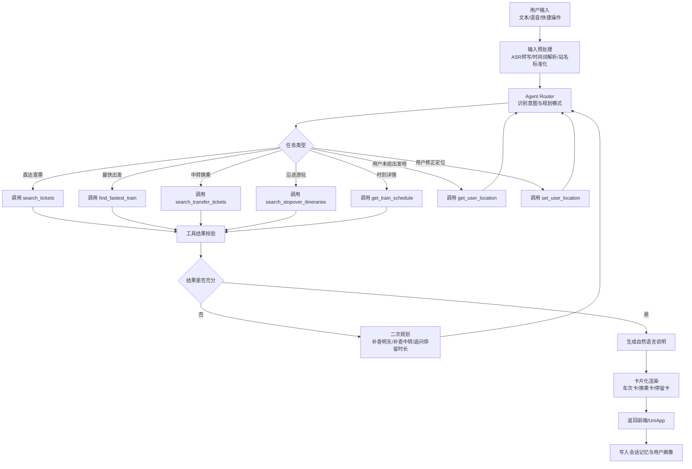
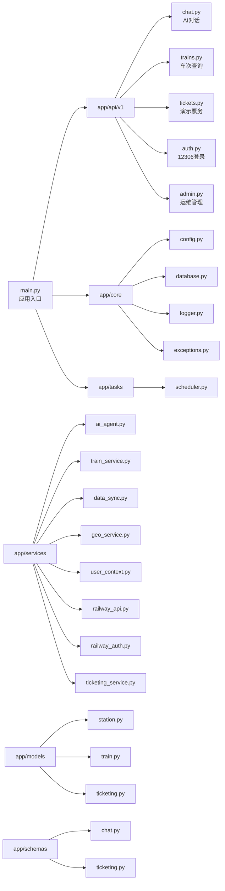
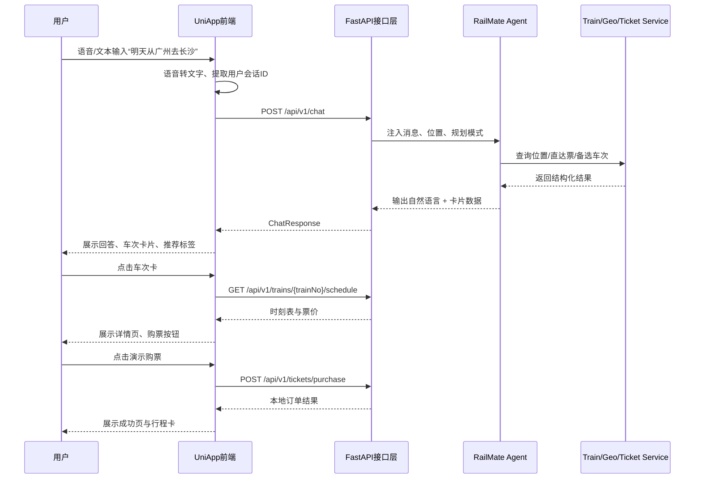

# RailMate 智轨伴行技术架构文档

## 1. 项目定位

RailMate 智轨伴行是一个面向铁路出行场景的垂直 AI Agent 产品，目标不是单纯“查票”，而是把用户从“我想去哪”带到“我该怎么走、怎么买、怎么换乘、是否顺路玩一站、有没有更省钱/更省时方案”的完整决策过程。

项目已具备较成熟的技术雏形：后端采用 `FastAPI + SQLModel + SQLite + APScheduler + OpenAI Function Calling`，前端采用 `Next.js` 构建对话首页、查票页、车次详情页、设置页和行程页，并已具备语音输入、位置感知、演示购票、二维码登录 12306、分模式规划等关键能力。为了比赛展示，本文档将其整理为“LangChain Agent 思维模型 + FastAPI 后端中台 + UniApp 多端交互接入”的完整技术方案。

## 2. 总体架构

```mermaid
flowchart TB
    U[用户\n旅客/通勤者/学生/出差人群] --> C1[CUI 对话入口\n文本/语音/快捷提问]
    U --> C2[GUI 卡片入口\n查票表单/路线卡片/行程卡片]
    U --> C3[UniApp 多端入口\nH5/小程序/App]

    C1 --> API[FastAPI 网关层]
    C2 --> API
    C3 --> API

    API --> CHAT[/chat 会话编排]
    API --> TRAIN[/trains 数据查询]
    API --> TICKET[/tickets 演示票务]
    API --> AUTH[/auth 12306 登录]
    API --> ADMIN[/admin 运维接口]

    CHAT --> AGENT[RailMate Agent Orchestrator\nLangChain 风格工具编排]
    AGENT --> MEM[Conversation Memory\n会话上下文]
    AGENT --> UCTX[User Context\n位置/偏好/历史]
    AGENT --> TOOLS[Tool Registry]

    TOOLS --> T1[search_tickets]
    TOOLS --> T2[search_transfer_tickets]
    TOOLS --> T3[search_stopover_itineraries]
    TOOLS --> T4[get_train_schedule]
    TOOLS --> T5[get_user_location]
    TOOLS --> T6[set_user_location]

    T1 --> TS[TrainService]
    T2 --> TS
    T3 --> TS
    T4 --> TS

    TS --> DB[(SQLite / SQLModel)]
    TS --> R12306[12306 官方查询能力]
    AUTH --> R12306
    TICKET --> DB

    API --> GEO[GeoService\nIP/GPS/自动定位]
    GEO --> CCTX[城市-车站映射]

    ADMIN --> SCH[APScheduler]
    SCH --> SYNC[DataSyncService]
    SYNC --> DB
```

### 架构解读

- 最上层是多入口交互层，既支持对话式输入，也支持结构化 GUI 查询，还预留了 `UniApp` 跨端接入能力。
- 中间层是 `FastAPI` 提供的标准化 API 能力，把 AI 编排、查票、购票演示、认证、管理能力解耦成清晰的领域服务。
- 核心智能层采用“LangChain Agent 思维模型”：即 **LLM + Memory + Tools + Policy** 的组合，虽然当前仓库实际落地为 OpenAI Function Calling，但其工作方式与 LangChain / LangGraph 的 Agent 编排高度一致，后续可平滑迁移到真正的 LangChain Runtime。
- 数据层分为三种来源：本地结构化数据、官方铁路查询接口、用户上下文与会话状态。

## 3. LangChain Agent 流程图

> 说明：当前代码位于 `app/services/ai_agent.py`，核心是自定义 Agent；比赛文档将其抽象为 LangChain 风格 Agent 流程，更利于评委理解“规划—调用—验证—返回”的闭环。



### Agent 关键机制

#### 3.1 Planning Mode

项目已经具备三类规划模式，可视为 Agent 的“策略层”：

- `efficient`：高效赶路，优先直达、控制中转次数。
- `rail_experience`：强调铁路运行体验，可接受更多换乘段。
- `stopover_explore`：面向沿途游玩、顺路停留、城市探索场景。

#### 3.2 Tool Calling

工具层已覆盖铁路出行最核心的决策链路：

- 查直达票
- 查最快可赶上的车
- 查中转方案
- 查沿途停留分段行程
- 查时刻表
- 查/设用户位置

这种设计使 Agent 既能“说人话”，又能“拿到结构化结果”，符合比赛中对 AI 场景产品“可解释、可执行、可扩展”的要求。

#### 3.3 Context Awareness

Agent 会综合以下上下文做判断：

- 当前日期、时段与是否来得及赶车
- 用户所在城市与推荐高铁站
- 用户偏好：速度优先、价格优先、平衡模式
- 用户偏好：风景/运转优先，还是尽快到达
- 最近历史线路与常用出发地

## 4. FastAPI 后端结构

### 4.1 目录级分层



### 4.2 后端职责说明

#### API 层

- 对前端、UniApp、小程序统一提供 HTTP 能力。
- 负责参数校验、错误封装、响应模型标准化。
- 将对话、查票、购票、认证、管理能力分离，便于单模块扩展。

#### Service 层

- `ai_agent.py`：智能核心，负责 Prompt、Tool Registry、Conversation Memory、Planning Mode。
- `train_service.py`：铁路业务服务层，负责查询车次、票价、时刻表、中转方案、沿途停留方案。
- `geo_service.py`：处理 `IP / GPS / 自动定位`，把城市映射为推荐车站。
- `user_context.py`：维护用户位置、偏好、历史，增强 AI 的个性化决策。
- `railway_auth.py`：通过二维码登录 12306，保存 Cookie，用于票价等需要鉴权的接口。
- `ticketing_service.py`：当前以离线演示模式实现购票、退票、行程管理，便于比赛演示与前端联调。

#### 数据层

- `SQLite`：支撑原型阶段快速迭代。
- `SQLModel`：提供更清晰的 ORM 定义，未来可平滑迁移至 `PostgreSQL`。
- 定时任务负责站点与车次数据同步，兼顾本地缓存与实时查询。

### 4.3 后端优势

- **结构清晰**：模块边界明确，便于多人协作和比赛演示。
- **AI 原生**：不是简单 REST 服务，而是以 Agent 为核心进行路由。
- **可灰度升级**：可从演示票务逐步走向真实交易闭环。
- **多端复用**：Web、UniApp、小程序均可复用同一后端能力。

## 5. 爬虫与合规说明

RailMate 在比赛展示中必须强调“技术先进，同时尊重平台规则、用户数据安全与交易边界”。因此项目在合规设计上遵循如下原则：

### 5.1 数据来源原则

- 优先使用官方公开可访问的铁路查询能力与合法认证链路。
- 对票价、登录态等敏感能力，严格基于用户主动授权后的会话信息获取。
- 不绕过登录、不篡改交易链路、不伪造真实订单。

### 5.2 用户授权原则

- 用户需要主动发起 12306 扫码登录，项目不保存明文密码。
- 登录结果仅在本地受控缓存 Cookie，且设置有效期，支持主动退出。
- 对 GPS 定位、IP 定位等能力采取“最小必要原则”，仅用于推荐附近站点和提升查询效率。

### 5.3 演示模式边界

当前仓库已经实现清晰的合规隔离：

- 购票/退票/行程查询默认处于 `demo_mode`。
- 所有订单写入本地数据库，不会修改真实 12306 订单。
- 页面与接口明确提示“演示模式”，避免用户误解为真实支付或真实出票。

### 5.4 平台友好策略

- 控制请求频率，避免高并发、暴力轮询、异常重放。
- 对公共数据使用缓存，减少重复请求。
- 对敏感接口设置失败回退与重试上限。
- 通过中台统一管理请求头、Cookie、异常处理，避免无序调用。

### 5.5 风险治理策略

- 对“买长乘短”“跨站补票”“中途下车”等敏感场景，产品默认先给出规则提醒与风险提示。
- 对异常站名、国外定位、模糊时间词等场景，Agent 优先澄清或给出安全替代方案。
- 对后续商业化版本，建议补充：审计日志、风控阈值、隐私条款、用户授权记录。

### 5.6 合规结论

RailMate 不是传统意义上的“抢票爬虫”，而是一个 **以 AI 决策为核心、以官方信息查询为基础、以演示模式做交易闭环验证** 的铁路场景智能应用。其比赛价值在于智能体验创新，而非高风险的数据抓取本身。

## 6. UniApp 交互流程

虽然当前仓库前端主体为 `Next.js`，但项目架构天然适合向 `UniApp` 扩展，用于小程序、App 和 H5 统一交付。比赛文档中可将其定义为“多端战略路线”。



### UniApp 交互分层建议

- **展示层**：聊天页、查票页、车次详情页、我的行程页、设置页。
- **能力层**：语音识别、定位授权、扫一扫登录、消息通知。
- **服务层**：统一封装 `chat / trains / tickets / auth / settings` API。
- **状态层**：会话、用户位置、最近路线、偏好配置、本地缓存。

### 为什么适合 UniApp

- 铁路场景天然需要移动端，尤其是“边走边问、边问边买、站内查看行程”的高频移动使用习惯。
- `FastAPI` 已把能力做成标准接口，UniApp 只需完成 UI 适配与设备能力接入。
- 对比赛而言，UniApp 方案能强化“可落地、多端触达、面向真实用户”的产品感。

## 7. 高可用与扩展路线

### 7.1 非功能特性

- **响应速度**：高频查票走缓存或轻量查询，减少等待。
- **可扩展性**：支持继续增加酒店、地铁、打车、站内服务等工具。
- **可解释性**：每一条推荐都有结构化依据，适合比赛答辩。
- **可运营性**：管理接口、统计接口、任务调度已经具备中台雏形。

### 7.2 下一阶段升级建议

1. 将 Agent Runtime 迁移至 `LangChain + LangGraph`，把复杂规划过程显式图化。
2. 将 `SQLite` 升级为 `PostgreSQL + Redis`，增强高并发与缓存能力。
3. 增加 RAG 知识库：退改签规则、车站攻略、旅游玩法、站内步行时间。
4. 增加风控与权限模块：登录鉴权、接口限流、设备指纹、操作审计。
5. 增加事件驱动通知：候补提醒、发车前提醒、换乘提醒、站台变更提醒。

## 8. 总结

RailMate 的技术架构价值，不在于简单地“把 LLM 接到查票接口上”，而在于把铁路出行这一复杂场景拆成了 **自然语言理解、上下文感知、工具编排、结构化呈现、多端接入、交易演示闭环** 六个层次，并形成了一套可比赛展示、可原型验证、可继续商业化演进的完整技术方案。

对“全球 AI 场景实战创新大赛”而言，RailMate 最强的亮点是：

- 场景足够真实且高频；
- Agent 不是噱头，而是核心决策引擎；
- 后端、前端、多端方案齐备；
- 合规意识明确，交易边界清晰；
- 具备从 Demo 走向产品化的演进路径。
